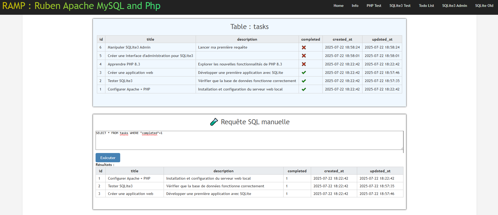
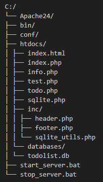

# RAMP Serveur léger Apache / PHP / SQLite

# 🚀 RAMP – Serveur PHP/SQLite autonome

Bienvenue dans **RAMP** (Ruben Apache MySQL and PhP) — une mini-plateforme de développement web **portable**, **sans installation**, basée sur **Apache + PHP + SQLite**, pour créer, tester et administrer des projets localement sans dépendre de Windows ou de services externes.

---

## 🧩 Contenu du projet

---

## 🧪 Les pages disponibles

| Fichier         | Description |
|-----------------|-------------|
| `index.html`    | Confirme que le serveur Apache est actif. |
| `index.php`     | Affiche un diagnostic de PHP + état de la base SQLite `tasks` (`todolist.db`). |
| `todo.php`      | Application simple de todo-list connectée à `todolist.db`. |
| `sqlite.php`    | Interface graphique pour visualiser et manipuler les tables SQLite et exécuter des requêtes SQL. |
| `info.php`      | Page standard `phpinfo()` pour visualiser la config PHP. |
| `test.php`      | Diagnostic complet sur les modules PHP, SQLite, et autres extensions. |

---

## ▶️ Lancer le serveur

### 🔧 Étapes simples :

1. **Extraire l’archive Apache24** à la racine de ton disque :  
   `C:\Apache24\`

2. **Lancer le serveur Apache** :  
   Double-cliquer sur `start_server.bat`

3. **Ouvrir le navigateur** et accéder à :  
   [http://localhost](http://localhost)

4. **Arrêter le serveur Apache** :  
   Double-cliquer sur `stop_server.bat`

---

## 🛠️ Fonctionnalités principales

- ✅ Serveur **Apache** avec configuration autonome
- ✅ Interpréteur **PHP 8.3** portable
- ✅ Support **SQLite3** intégré (aucun serveur MySQL requis)
- ✅ Application de **todo-list** fonctionnelle
- ✅ Interface d’administration SQLite (visualisation & requêtes)
- ✅ Pages de **diagnostic PHP**
- ✅ Prêt à l’emploi en un clic

---

## 💡 Objectif futur

Permettre à **RAMP de fonctionner depuis n'importe quel dossier** (pas seulement `C:\Apache24`) en rendant les chemins **dynamiques** dans les fichiers :

- `httpd.conf` (pour DocumentRoot, ScriptAlias, etc.)
- `php.ini` (si tu as des chemins absolus définis)
- `start_server.bat` et `stop_server.bat`

👉 **Oui, c’est possible** de rendre RAMP **entièrement portable** et exécutable d’un clic sans dépendance au disque `C:`. On peut le faire avec :
- Des **variables d’environnement dynamiques** dans les scripts `.bat`
- Une **configuration Apache relative** avec `%~dp0` (le dossier du script)

Je te prépare ça dès que tu veux.

---

## 📁 Crédits

Projet personnel de rubentrottein@github.com – Pour apprendre, tester et prototyper localement sans prise de tête.

---

